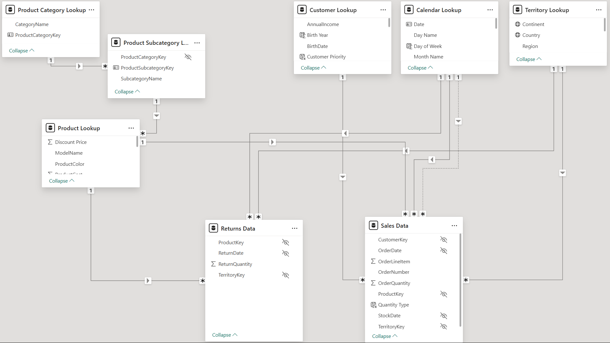

# AdventureWorks BI Dashboard

## Overview
The BI workflow used in this project is structured as follows: 
- Connecting and Shaping Data (ETL)
- Creating a Data Model (Data Modelling)
- Calculating Explicit Measures with DAX (Building Meaningful Business Metrics)
- Visualizing Data (Report Building & Optimisation)

Detailed description for every step of the dashboard building process can be found [here](https://www.notion.so/AdventureWorks-Notebook-2ffeb796c52780ecb17ed27b7b9fdd3e?source=copy_link).

## Objective
To create a comprehensive dashboard where essential business-related KPIs can be tracked at different levels of detail for AdventureWorks, a global manufacturing company involved in the bicycle industry. 

## Data Used
[Dataset](Data) used is raw csv files, which contain information about transactions, returns, products, customers, and sales territories for the company.

## Data Model (OLAP)

The data is shaped and transformed using Power Query Editor. The 'Model View' in Power BI Desktop is used to build table relationships.

## What does the project deliver?
Business performance is measured through KPIs on sales, profit, revenue, returns, etc. The entire business report is made from raw text files present in the repository. 

### Executive Dashboard
- High-level KPIs including Sales, Revenue, Profit, Orders, and Return metrics
- Trend analysis to monitor overall business performance over time
- Interactive filtering to enable leadership-level performance reviews

### Geographic (Map) Analysis
- Regional performance visualization to identify high- and low-performing territories
- Sales distribution insights supporting expansion and optimization strategies

### Product Detail Report
- Deep dive into product-level performance
- Identification of top revenue drivers and underperforming SKUs
- Return analysis to highlight quality or operational inefficiencies

### Customer Detail Report
- Customer segmentation insights
- Analysis of purchasing behavior and contribution to total revenue
- Visibility into high-value customers to support retention strategies
